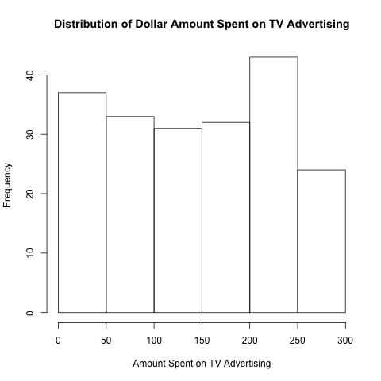
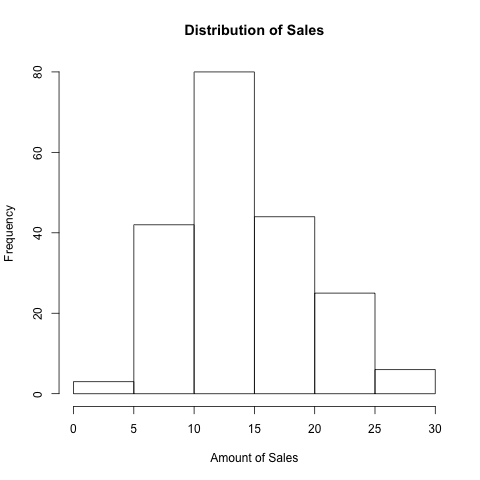
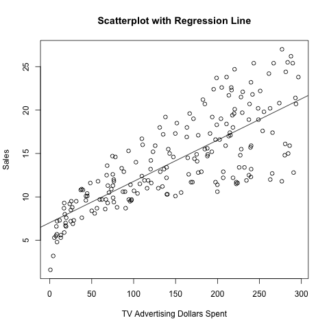

Joseph Francia  
Professor Gaston Sanchez  
Stats 159  
7 October 2016  

#Abstract

&nbsp;&nbsp;&nbsp;&nbsp;&nbsp;&nbsp; In this report, I'm going to first examine sales data and the dollar amount spent on television advertising separately. Afterwards, I am going to show the relationship between advertising and sales by running a regression of sales on advertising. I will then discuss the relevant regression statistics from this regression I ran.  

#Introduction

&nbsp;&nbsp;&nbsp;&nbsp;&nbsp;&nbsp; All the internet products that I use are free. **Facebook**, **Gmail**, and **Google**, amongst many other technology products, are all free to use. The only source of revenue for these companies is essentially advertising revenue. So how effective is it to advertise? Moreover, how would one go about testing the effectiveness of advertising? In this report, I am going to examine a dataset that contains data on both television advertising and revenues.

#Data

&nbsp;&nbsp;&nbsp;&nbsp;&nbsp;&nbsp; Before we have a discussion on how we're going to use the data, lets first take a look at the advertising and revenues datasets individually. The histogram of advertising indicates that the distribution of advertising is fairly uniform and ranges from 0 to around 300. Meanwhile, the histogram of sales is skewed slightly to the right with the center at values between 10 and 15. These histograms are shown in the following pages. 

  

#Methodology

&nbsp;&nbsp;&nbsp;&nbsp;&nbsp;&nbsp; In order to analyze the relationship between advertising and revenue, I first had to designate which variable was explanatory and which one was the response. In this assignment, the specification was for advertising spending to be the explanatory variable with revenues as the response. In order to measure the relationship between tv advertising spending and revenues, I ran a least squares regression. Least squares regression outputs a beta vector, which quantifies the relationship between advertising spending and revenues.  

#Results

&nbsp;&nbsp;&nbsp;&nbsp;&nbsp;&nbsp; So what did our least squares regression say about the relationship between ad spending and revenues? According to our least squares regression, for every dollar increase in tv ad spending, revenues go up by 4.754 cents. Here's a scatterplot that depicts the relationship between our two variables. I've also attached histograms of the individual datasets. 

  

&nbsp;&nbsp;&nbsp;&nbsp;&nbsp;&nbsp; This visual shows a pretty clear positive relationship between sales and tv ad spending. However, how do we know that the causation runs from tv ad spending to sales? In other words, do we even know for a fact that increasing tv ad spending leads to an increase in revenues? The short answer is no, we don't! We'll give the long answer in the next section.  

#Conclusions

&nbsp;&nbsp;&nbsp;&nbsp;&nbsp;&nbsp; Least squares regression tells us how variables move and interact with each other. It doesn't, however, tell us which direction the causation runs. For instance, it could very well be that increasing revenues causes an increase in ad spending. Maybe increasing revenues allows a company's advertising budget to increasing, thus causing more ad spending. This is called reverse causality. It could also very well be that increasing ad spending is merely positively correlated with another variable that actually causes revenue increases. This is called omitted variable bias.  
&nbsp;&nbsp;&nbsp;&nbsp;&nbsp;&nbsp; In short, the results of least squares regression should always be taken with a grain of salt. Demonstrating a mere relationship between two variables does not imply any sort of causation between variables in either direction. 

